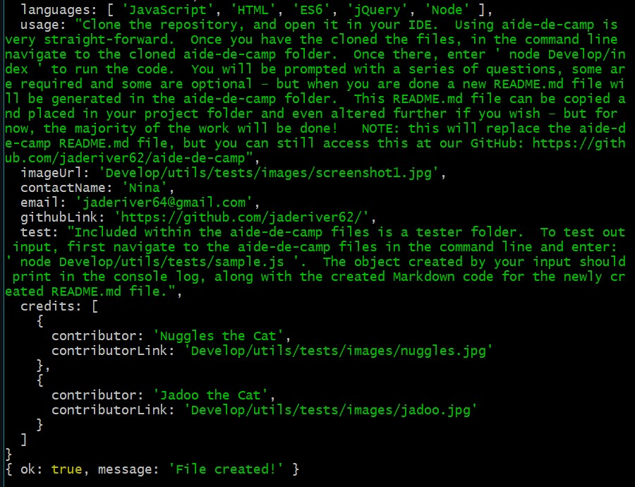

# aide-de-camp

---------------------------------------

## Description

This is an app that generates a quality README.md document for projects using Inquirer in the command line.  
There are many options for input possible whether the README.md is long or concise.  Using aide-de-camp ensures that the project's 
README.md looks great and is not at all anemic!  

Over time the options will be enhanced and improved even more, so please see the questions section for our contact information 
if you encounter any bugs have any questions at all or input as to how the UI can be made more helpful.

---------------------------------------

Project Link: 
[Aide de Camp (GitHub)](https://github.com/jaderiver62/aide-de-camp)

---------------------------------------

## Table of Contents
* [Installation](#installation)
* [Usage](#usage)
* [License](#license)
* [Testing](#testing)
* [Questions](#questions)
* [Contributions](#contributions)
---------------------------------------

Written using:

                    
* JavaScript
* HTML
* ES6 
* jQuery
* Node
   

---------------------------------------

## Installation
Our project is quite to install at the moment.  You must have Node.js - (https://nodejs.org/)  and npm- (https://www.npmjs.com/) installed to use aide-de-camp.  For future endeavors aide-de-camp plans to publish a package on npm that makes this process even easier. 

---------------------------------------

## Usage

Clone the repository, and open it in your IDE.  Using aide-de-camp is very straight-forward.  Once you have the cloned the files, in the command line navigate to the cloned aide-de-camp folder.  Once there, enter ' node Develop/index ' to run the code.  You will be prompted with a series of questions, some are required and some are optional – but when you are done a new README.md file will be generated in the aide-de-camp folder.  This README.md file can be copied and placed in your project folder and even altered further if you wish – but for now, the majority of the work will be done!   NOTE: this will replace the aide-de-camp README.md file, but you can still access this at our GitHub: https://github.com/jaderiver62/aide-de-camp

---------------------------------------

## Testing
Included within the aide-de-camp files is a tester folder.  To test out input, first navigate to the aide-de-camp files in the command line and enter: ' node Develop/utils/tests/sample.js '.  The object created by your input should print in the console log, along with the created Markdown code for the newly created README.md file.

---------------------------------------

## Contributions

                     
* [Nuggles the Cat](Develop/utils/tests/images/nuggles.jpg)
                     
* [Jadoo the Cat](Develop/utils/tests/images/jadoo.jpg)
                     

---------------------------------------

## Questions

For any input, concerns, bugs or questions please get in touch!  Simply reach out to [Nina](https://github.com/jaderiver62/) via GitHub or via e-mail: <jaderiver64@gmail.com>.

---------------------------------------

## Licence

#### This project is licensed under the [MIT License](https://opensource.org/licenses/MIT).
#### &copy; 2021 Nina Cummings

---------------------------------------
    